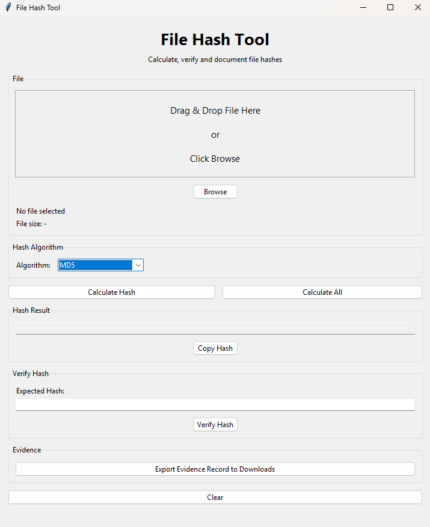
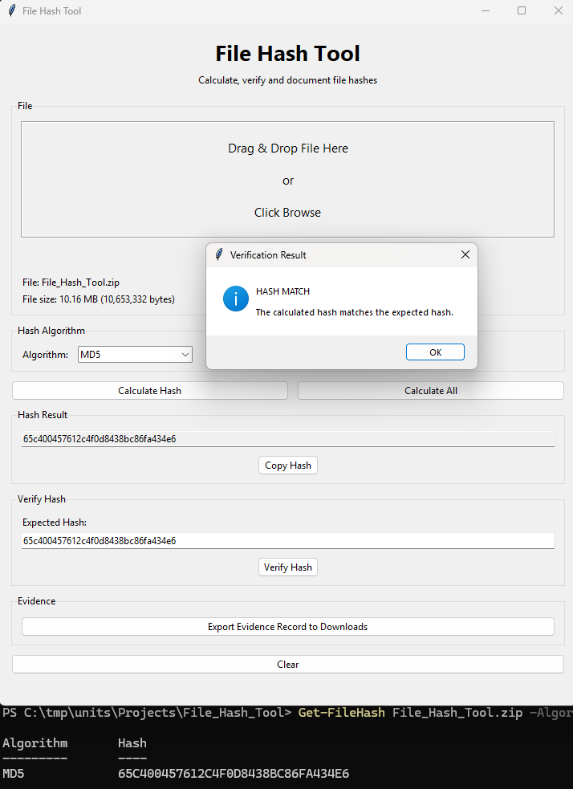

# File Hash Tool

A lightweight Python desktop application for quickly calculating, comparing and documenting file hashes.

I created this as a quick **pocket-access tool** for checking file hashes without having to repeatedly type long PowerShell or command-line commands. Select or drag and drop a file, choose the algorithm, and click the button.



## Features

* GUI-based file hashing
* Drag and drop files
* Browse for files
* MD5 selected by default
* Calculate an individual hash
* Calculate all supported hashes
* Verify a hash against an expected value
* Copy hashes to the clipboard
* Display file name and file size
* Read-only source file processing
* Export a timestamped evidence record
* 1 MB chunked file processing
* Ready-to-use Windows executable
* Python source code included

## Supported Hash Algorithms

* MD5
* SHA-1
* SHA-224
* SHA-256
* SHA-384
* SHA-512
* SHA3-224
* SHA3-256
* SHA3-384
* SHA3-512
* BLAKE2b
* BLAKE2s

## How It Works

1. Select or drag and drop a file.
2. Choose a hashing algorithm.
3. Click **Calculate Hash**.
4. Enter an expected hash if verification is required.
5. Click **Verify Hash**.
6. Export an evidence record if required.

The source file is opened in read-only binary mode and processed in 1 MB chunks.

## Hash Verification

The tool compares the calculated hash against the expected hash and reports either a **HASH MATCH** or **HASH MISMATCH**.

Example:

```text
Expected Hash:
65c400457612c4f0d8438bc86fa434e6

Calculated Hash:
65c400457612c4f0d8438bc86fa434e6

Result:
MATCH
```

## Evidence Record

The tool can export a timestamped text record to the Windows **Downloads** folder.

The record includes:

* File name
* File path
* File size
* Hash algorithm
* Calculated hash
* Expected hash
* Verification result
* Date and time
* Read-only processing status

## MD5 Verification

The following image shows the MD5 hash of the application generated using PowerShell.



```text
65c400457612c4f0d8438bc86fa434e6
```

## Download

A ready-to-use Windows executable is included:

```text
File_Hash_Tool.zip
```

Extract the ZIP and run:

```text
File_Hash_Tool.exe
```

No Python installation is required when using the packaged executable.

## Source Code

The Python source code is included in:

```text
File_Hash_Tool.py
```

## Technologies

* Python
* Tkinter
* tkinterdnd2
* hashlib
* pathlib
* PyInstaller

## Running From Source

Install the required dependency:

```powershell
python -m pip install tkinterdnd2
```

Run the application:

```powershell
python File_Hash_Tool.py
```

## Project Structure

```text
File_Hash_Tool/
│
├── File_Hash_Tool.py
├── File_Hash_Tool.zip
│
└── images/
    ├── File_Hash_Tool.png
    └── MD5-Hash.png
```
